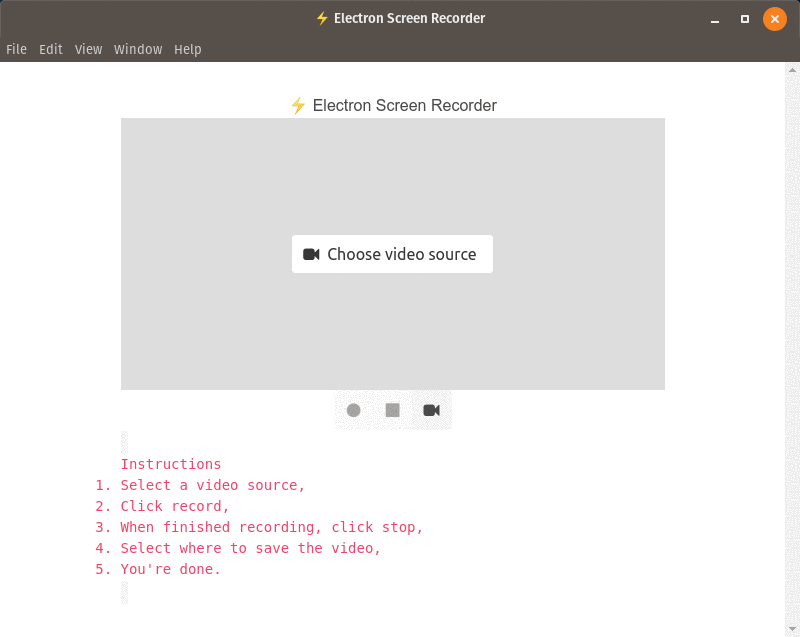

# ⚡ Electron Screen Recorder

## Contents
* [About](#about)
* [Features](#features)
* [Techs](#techs)
* [Installation](#installation)
* [Building](#building)
* [Usage](#usage)
* [Developing](#developing)
* [Contributing](#contributing)
* [Credits](#credits)

---

## About



This is a sample project developed with the intent to study and demonstrate the capabilities of Electron.
It was developed using web techs (such as HTML5, CSS3 and vanilla js) and built on Electron.

## Features
This app records your screen and saves for later. You can select the video source among your entire screen or and specific window.

## Techs

* HTML5
* CSS3
* Javascript
* Bulma CSS Framework
* Font Awesome
* NodeJS
* Electron

## Installation

```bash
$ git clone https://github.com/alande-amorim/electron-screen-recorder.git
$ cd electron-screen-recorder
$ npm install
```

## Building
You can now build the executables (eg. deb, exe).<br> Electron takes care of that too. <br>
With the repository already cloned and installed, build the binaries by running:

```bash
$ npm run make
```
Check inside `./out/` directory for the installable binaries.


## Usage

1. Install and launch the app
2. Select the video source. Click on "Choose video source" button. Select one of the options.
3. As soon as you've selected the video source, your select window or screen will be shown on the app.
4. Start recording. Click on "Record" button.
5. Finish recording. Click on "Stop" button to stop recording.
6. Save the video. As soon as you click on "stop" a pop up will be shown asking you where to download the video to.


## Developing
If you wish to change something, run `npm start` and a new window will open.

This npm process will be kept running as long as the window is opened.

Since there's no hot reloading built in this app, everytime you change something you need to refresh the app window. You can do that by sending `rs` into the npm process.


## Contributing
If you've found something wrong, feel free to open an issue or submit a pull request.

## Credits

The idea for this app came from Fireship's [video](https://www.youtube.com/watch?v=3yqDxhR2XxE). Make sure to check this [channel on Youtube](https://www.youtube.com/channel/UCsBjURrPoezykLs9EqgamOA).<br>
I just followed along and did some tweaks here and there.
